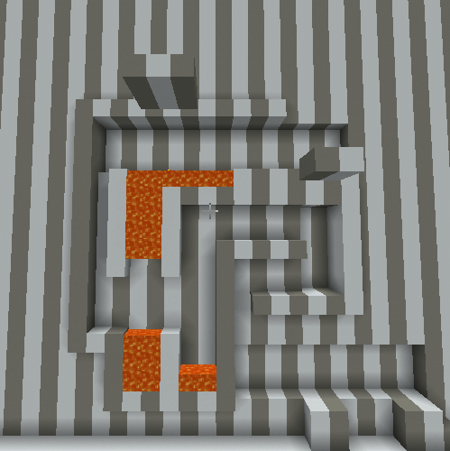

# Celestial Movement
This is a plugin that adds the movement mechanics of [Celeste](https://www.celestegame.com/) to Minecraft. Since this is a server side plugin the movement is a bit choppy :), not much I can do about that.  
This is my entry to the [Queer Coded](https://queercoded.dev/) Spigot plugin hackathon.  

## Features
- Wall Climbing
- Wall Jumping
- Midair Dash
  
## Usage

### Wall Climbing
Enable wall climbing with `/celestial wallclimb on`. Disable it with `/celestial wallclimb off`.  
Jump into a wall and sneak to climb it. Looking up will make you climb up, otherwise you will slowly slide down.  

### Wall Jumping
Enable wall jumping with `/celestial walljump on`. Disable it with `/celestial walljump off`.  
Jump into a wall and press jump twice to jump off of it.

### Midair Dash
Enable midair dash with `/celestial dash on`. Disable it with `/celestial dash off`.
Press jump while in the air to dash. By default you can only dash once. Using `/celestial dash double on` will allow you to dash twice in a row, and `/celestial dash double off` will disable it.  
To dash an unlimited amount of times, use `/celestial dash unlimited on`. This will also enable double dashing. To disable it, use `/celestial dash unlimited off`.  

### Building
1. Run `gradlew build` in the root directory of the project.
2. The built jar will be in `build/libs`.

This template isn't a comprehensive guide to making a plugin, but it can show you the basics of how to make a plugin.

### License
This template is licensed under MIT. See the LICENSE file for more information.